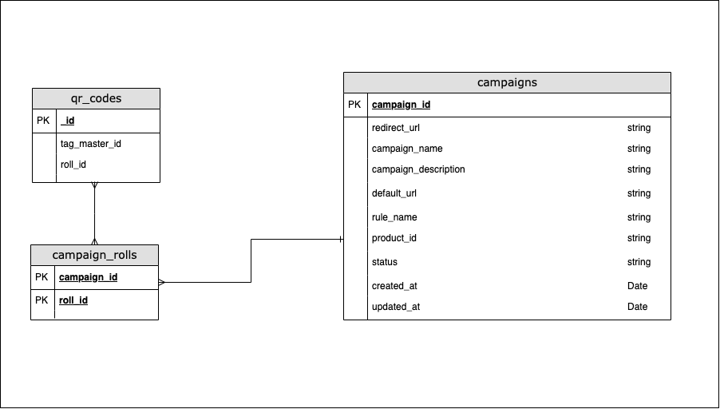

<h1>Smart Codes</h1>

  Phygiworld is a startup that transforms QR Codes into smart QR codes. 
  Standard QR codes are connected to static web URLs (e.g. https://mysite.com).
  With Phygiworld, instead, each QR code can load dynamic URLs that can be changed even after the QR is printed.

  As a developer of Phygiworld you are tasked to implement the core middleware
  function that runs when a user scans a QR code. 
  This function receives the QR code ID as an input and should redirect to the URL that
  is configured in the related campaign.

  Edit the index.js file and implement the <b>"/scan/:codeId"</b> endpoint so that it redirects to the correct URL defined in the campaign.
  Use the repositories available to query data in the database as needed. All data is mocked and stored in JSON files in the mock_data directory.
  Below is a schema of the database tables.

  

You can run the script using

<pre>node index.js</pre>

You can test the API by opening:

<a href="http://localhost:4000/scan/4Ns_mH4a">http://localhost:4000/scan/4Ns_mH4a</a>

<h1>Tests</h1>

1. http://localhost:4000/scan/4Ns_mH4a should redirect to https://www.ryobi.com.au/power-tools/products/details/600w-biscuit-joiner-ebj900rg
2. http://localhost:4000/scan/ABw0T6Vk should redirect to https://ozito.com.au/products/pxc-18v-multi-function-tool/
3. http://localhost:4000/scan/uXlsA0F4 should redirect to https://www.makita.com.au/building-construction/category/cutting/circular-plunge-cut-saws/hs009gz01-40v-max-brushless-235mm-9-1-4-circular-saw

<h1>Bonus</h1>

  Modify the endpoint logic so that:
  - if the campaign is in status "running", redirect using the redirect_url column
  - if the campaign is in status "stopped", redirect to the default_url column

